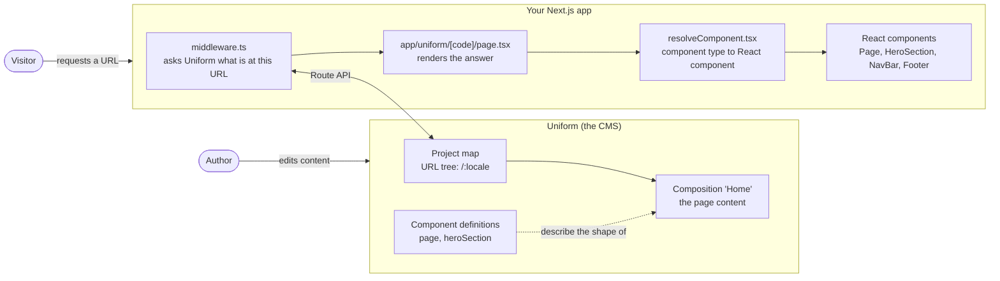
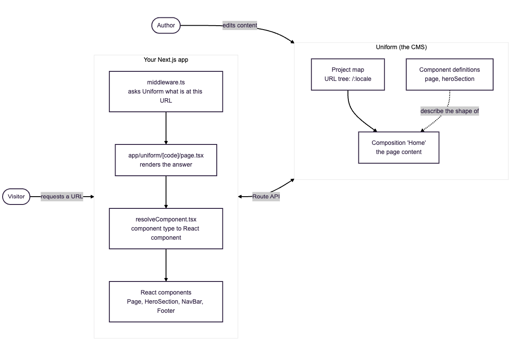
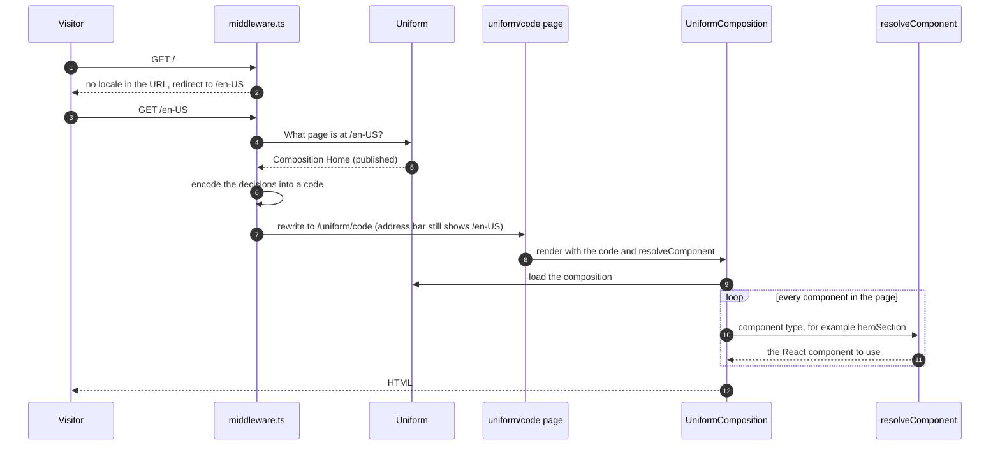
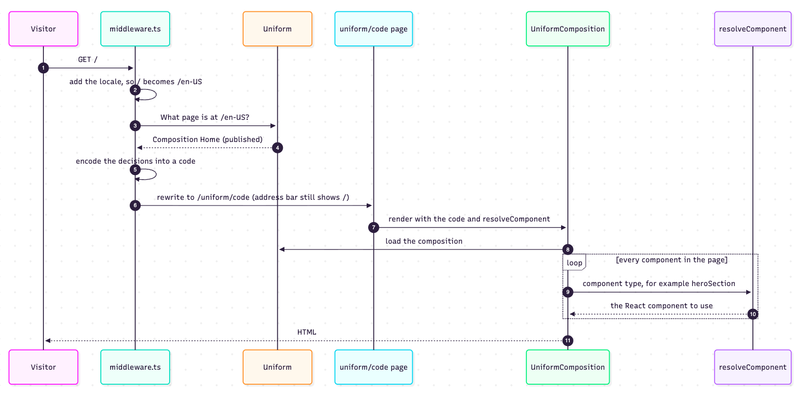
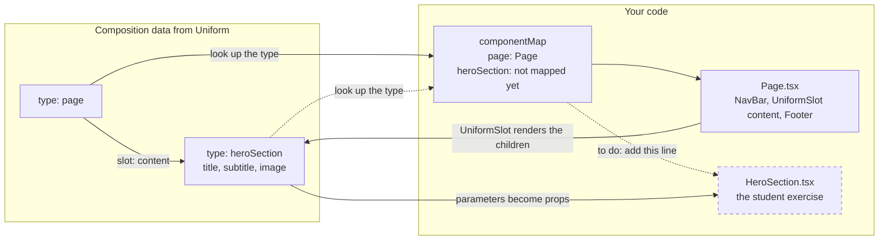
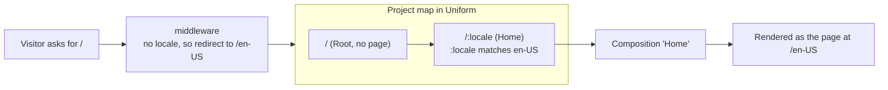
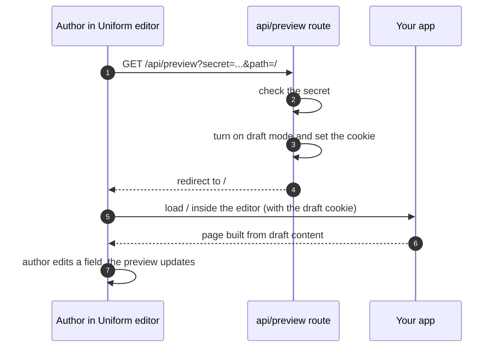
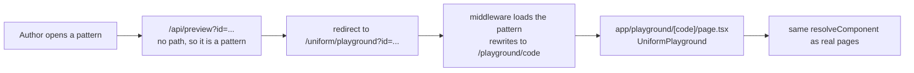

# How Uniform and Next.js fit together

Five diagrams, each answering one question. Read them in order. The step-by-step build is in [uniform-app-router-guide.md](./uniform-app-router-guide.md).

## 1. What are the pieces, and who owns what?

**Authors work in Uniform. Your Next.js app asks Uniform for the page and turns it into HTML.** No page content lives in your code.

**Teaching points**
- The URL to page mapping is configured in Uniform (the project map), not in code.
- The same code renders any page an author builds, as long as it knows how to render each component type.

## 2. What happens when someone visits a URL?

**The middleware looks the URL up in Uniform, then hands the result to one page that renders it.**

**Teaching points**
- The visitor never sees `/uniform/<code>`. It is an internal rewrite.
- If Uniform has nothing at the path, the middleware returns the 404 page. A redirect set up in Uniform becomes a real redirect.
- The folder name `[code]` is a Next.js placeholder. The code carries the middleware's decisions (path, draft or published, which variants), not the page content.

## 3. How does page data become React components?

**Each component in Uniform has a `type`. `resolveComponent` maps that type to a React component. Parameters become props, and slots become `UniformSlot`.**

**Teaching points**
- `type` is the component's public ID in Uniform. It is case-sensitive: `heroSection` is not `HeroSection`.
- An unmapped type shows a visible "couldn't be resolved" message. That message is the cue for the student exercise.
- Slots are how Uniform nests components. `Page` has a `content` slot, and the Hero sits inside it.

## 4. How does a URL find its page?

**The project map in Uniform decides. Our middleware makes sure the URL starts with a locale, so it finds the `/:locale` node.**

**Teaching points**
- `:locale` is a placeholder in the project map, like `[code]` is in Next.js folders.
- The supported locales are listed in `lib/uniform/locale.ts` (only `en-US` for now). A URL whose first segment is not in that list gets the default locale added by a redirect.
- If your project map has plain nodes (`/`, `/about`), you would not need the locale redirect.
- Adding a page means creating a composition and attaching it to a node in Uniform. No code change.

## 5. How does live preview work for authors?

**The editor opens your site through `/api/preview`. That turns on draft mode, so the page shows unpublished content.**

**Patterns use a second route, the playground:**

**Teaching points**
- The secret (`UNIFORM_PREVIEW_SECRET`) must match the preview URL saved in Uniform.
- Authors see unpublished content only while draft mode is on. Normal visitors always get published content.
- The playground uses the same `resolveComponent`, so every component you map works in patterns automatically.

## Files at a glance

| File | Job | Diagram |
|---|---|---|
| `middleware.ts` | Adds the locale by redirect, looks the URL up in Uniform, then rewrites to the render page | 2, 4 |
| `lib/uniform/locale.ts` | Supported locales and the default locale | 4 |
| `app/uniform/[code]/page.tsx` | Renders the page for a code | 2 |
| `app/components/resolveComponent.tsx` | Maps component types to React components | 3 |
| `app/components/Page.tsx` | Page layout: NavBar, content slot, Footer | 3 |
| `app/components/HeroSection.tsx` | The component students connect to Uniform | 3 |
| `app/api/preview/route.ts` | Turns on draft mode for the editor | 5 |
| `app/playground/[code]/page.tsx` | Renders patterns | 5 |
| `lib/uniform/CustomUniformClientContext.tsx` | Browser-side Uniform setup and the dev toolbar | 1 |
| `app/static/` | Finished hardcoded reference site, not connected to Uniform | none |
