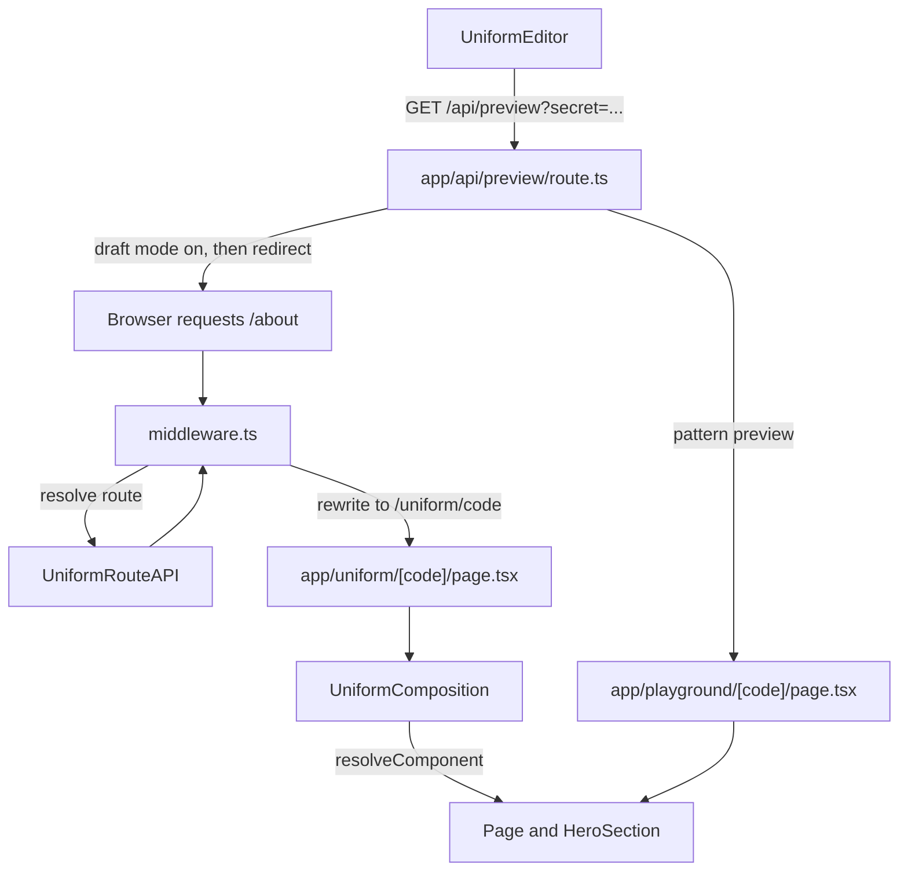

# Connecting Uniform to a Next.js App Router app

This guide walks through every piece of the Uniform integration in this project, in the order you would build it. The code files are kept short and mostly comment-free on purpose. **All the explanations live here.**

We use Uniform's current SDK for the App Router, `@uniformdev/next-app-router` (the "v2 SDK"). It needs Next.js 16 and Node.js 22 or newer. The official reference is the [Next.js App Router SDK documentation](https://docs.uniform.app/docs/sdk/nextjs-app-router).

New to how the pieces fit together? Start with the diagrams in [architecture.md](./architecture.md).

## What you will build

- Middleware that asks Uniform "what page lives at this URL?" and hands the answer to a page that renders it.
- Live preview: authors edit in Uniform and see changes in your site as they type.
- A preview endpoint that Uniform calls to switch your site into draft mode.
- A playground page where authors design component patterns.



## Files at a glance

- `middleware.ts` - runs before every page request; resolves the URL to a Uniform page.
- `lib/uniform/locale.ts` - the supported locales and the default locale (`en-US`), used by the middleware and the static params.
- `app/uniform/[code]/page.tsx` - the page the middleware rewrites to; renders the composition.
- `app/components/resolveComponent.tsx` - maps Uniform component types to React components.
- `app/components/Page.tsx` - the page layout: a hardcoded NavBar and Footer around the `content` slot.
- `app/components/NavBar.tsx`, `app/components/Footer.tsx` - hardcoded header and footer shown on every Uniform page.
- `app/components/HeroSection.tsx` - the Hero component.
- `app/api/preview/route.ts` - the preview endpoint Uniform calls.
- `app/playground/[code]/page.tsx` - the pattern playground.
- `lib/uniform/CustomUniformClientContext.tsx` - client-side Uniform setup (dev tools and the Uniform Toolbar).
- `next.config.ts` - allowed image hosts, wrapped in `withUniformConfig`.
- `app/static/` - the hardcoded reference site at `/static` and `/static/article` (see below). Its plain components live in `app/static/_components/`.

### The static site is your reference

The repo contains a finished, hardcoded version of the site at **`/static`** (and `/static/article`). It is built from plain React components (`NavBar`, `HeroSection`, `ContentBlock`, `ImageWithText`, `TopicCards`/`TopicCard`, `FeaturedProducts`/`ProductCard`, `LatestArticles`/`BlogArticleIntro`, `BlogArticleDetail`) in `app/static/_components/`. Their content is hardcoded in `app/static/page.tsx` and passed in as props. The folder starts with an underscore, so Next.js does not treat it as a route.

**Do not edit the static site.** It is the target you compare against. The real home page, `/`, is served by Uniform through the middleware, and renders whatever page you publish on the home node of the project map (`/:locale`, see Step 4). The middleware is told to skip `/static`, so the reference site always works.

The components in `app/components/` are the ones you convert to Uniform, one at a time, starting with `HeroSection`. That file is a plain copy of the static Hero, so converting it never breaks `/static`. Until you publish a home page in Uniform, `/` returns 404.

## Step 1 - Install the package

```bash
pnpm add @uniformdev/next-app-router @uniformdev/next-app-router-client @uniformdev/context @uniformdev/toolbar-react @uniformdev/canvas
pnpm add -D @uniformdev/cli
```

This project uses `pnpm` because it has a `pnpm-lock.yaml`.

- `@uniformdev/next-app-router` - the SDK: middleware, composition rendering, preview handlers, `UniformText`, `UniformSlot` and more. It is the only package you strictly need.
- `@uniformdev/next-app-router-client`, `@uniformdev/context` - used by `lib/uniform/CustomUniformClientContext.tsx` to set up Uniform's client-side context.
- `@uniformdev/toolbar-react` - the Uniform Toolbar, a development-only overlay for inspecting and simulating visitors.
- `@uniformdev/canvas` - types and helpers such as `flattenValues` and `AssetParamValue`. The SDK installs it too, but we import from it directly, so it is listed as our own dependency.
- `@uniformdev/cli` - dev-only. Used by `pnpm uniform:pull` to save your Uniform definitions into `uniform-data/`. Never edit those files by hand.

## Step 2 - Environment variables

In `.env`:

```bash
UNIFORM_API_KEY=...            # needs "Read Published Compositions" permission
UNIFORM_PROJECT_ID=...
UNIFORM_PREVIEW_SECRET=hello-world
```

`UNIFORM_PREVIEW_SECRET` is a shared password. Uniform sends it to `/api/preview`, and the route refuses to turn on draft mode unless it matches. Use any value you like, but it must match the preview URL you save in Uniform (Step 4).

## Step 3 - Next.js config and allowed images

File: `next.config.ts`

The config is wrapped in `withUniformConfig(nextConfig)`. This sets up the SDK's internal settings. (You can add an optional `uniform.server.config.ts` file to change SDK defaults such as the playground path or default consent. We do not need one.)

`HeroSection` uses `next/image`, and Next.js only optimises images from hosts you list. `next.config.ts` already allows `images.unsplash.com` (the sample photos) and `img.uniform.global`. If your Uniform assets come from another host, add it:

```ts
images: {
  remotePatterns: [
    { protocol: "https", hostname: "img.uniform.global" },
  ],
},
```

If an image shows a 400 error, open the image URL in the Uniform asset library, check the hostname, and add it here.

## Step 4 - Set things up in Uniform

Do this in the Uniform dashboard for **your** project (check the project id matches `UNIFORM_PROJECT_ID`).

1. **Page** - a composition definition with public ID `page`. Add a slot with public ID `content`. (You can also add `header` and `footer` slots now; the starter does not render them yet because the NavBar and Footer are hardcoded.) For each slot choose "allow all components" and turn off "inherit allowed components" and "patterns in allowed components".
2. **Hero Section** - a component with public ID `heroSection` and three parameters:
   - `title` (text)
   - `subtitle` (text)
   - `image` (asset, images only)
3. **Hero pattern** - create a component pattern from Hero with sample copy, and make every parameter overridable.
4. **A page to render** - create a composition of type Page, add a Hero Section to its `content` slot, and attach it to the project map node `/:locale` (a new Uniform project has this node, named Home). `:locale` is a placeholder for the visitor's locale, so this page lives at `/en-US`. Our middleware (Step 5) redirects `/` to `/en-US`, so the home page opens from `/` too. Publish the page.
5. **Preview URL** - in the project's preview settings add `http://localhost:3000/api/preview?secret=hello-world`. Uniform asks the endpoint whether a playground exists and finds out automatically that it does.
6. Run `pnpm uniform:pull` to save the definitions into `uniform-data/`.

The public IDs matter: the strings `page` and `heroSection` must exactly match the component `type` you look up in `resolveComponent` (Step 7). Matching is case-sensitive: `HeroSection` would not match `heroSection`.

## Step 5 - The middleware

File: `middleware.ts`

```ts
const handleUniform = uniformMiddleware({
  rewriteDestinationPath: async ({ code, source }) =>
    source === "playground" ? `/playground/${code}` : "",
});

export default function middleware(request: NextRequest) {
  const { pathname } = request.nextUrl;

  if (!pathname.startsWith(playgroundPath) && !hasLocale(pathname)) {
    const url = request.nextUrl.clone();
    url.pathname = `/${defaultLocale}${pathname === "/" ? "" : pathname}`;
    return NextResponse.redirect(url);
  }

  return handleUniform(request);
}
```

This is the heart of the SDK. For every page request, the middleware:

1. Asks the Uniform Route API which composition lives at the requested path.
2. Works out any personalization or A/B test variants for the visitor (we do not use these yet).
3. Rewrites the request to `/uniform/<code>`. The visitor's address bar still shows the requested URL (for example `/en-US`). `<code>` is a short encoded string holding the middleware's decisions: which path was requested, draft or published, and which personalization or test variants this visitor gets. It does **not** contain the page content. The page decodes it and loads the content itself.
4. Returns a 404 page if Uniform has nothing at that path, and issues redirects that are configured in Uniform.

The `matcher` decides which requests the middleware sees. Ours skips `api`, `static`, Next.js internals and a few well-known files:

```ts
matcher: ["/((?!api|static(?:/|$)|_next/static|_next/image|favicon.ico|sitemap.xml|robots.txt).*)"],
```

`static(?:/|$)` is our own addition. It keeps the hardcoded reference site at `/static` out of Uniform's hands.

**Locales.** Our project map has a `/:locale` node, so the home page is `/en-US`, not `/`. Our own `middleware` function runs first and makes sure every URL starts with a supported locale. If the first path segment is not in `locales` (from `lib/uniform/locale.ts`), it redirects (307) to the same URL with the default locale added: `/` goes to `/en-US`, `/about?x=1` goes to `/en-US/about?x=1`. This is the approach recommended in the [Next.js internationalization guide](https://nextjs.org/docs/app/guides/internationalization). Uniform's own playground URL, `/uniform/playground`, is skipped because it has no locale. Everything else is handed to `uniformMiddleware`, which looks the path up as is.

To support another language, add its code to `locales` (and enable it in Uniform on the pages that need it). Remove the redirect if your project map has plain nodes like `/` and `/about`.

`rewriteDestinationPath` is about the playground. The SDK's default is to rewrite playground requests to `/uniform/playground/<code>`. This project keeps its playground page at `app/playground/[code]`, so we tell the middleware to rewrite there instead. Uniform still opens `/uniform/playground` (the SDK's default playground URL); only the internal destination changes. Returning an empty string for normal pages means "use the default", `/uniform/<code>`.

`runtime: "experimental-edge"` comes from Uniform's documentation. It is needed so preview works on apps deployed to Vercel. Next.js 16 prints two warnings about it (the `middleware` file name is deprecated in favour of `proxy`, and the edge runtime is deprecated). Both are expected, and Uniform's docs still require `middleware.ts` for now.

## Step 6 - The page that renders a composition

File: `app/uniform/[code]/page.tsx`

The middleware rewrites every Uniform page request to this route. The folder name `[code]` is a Next.js dynamic segment: a placeholder that matches any value and passes it to the page as `params.code`. Here that value is the encoded string from the middleware (see Step 5). The page:

1. `await props.params` - in this version of Next.js `params` is a Promise.
2. Renders `<UniformComposition code={code} resolveRoute={resolveRouteFromCode} resolveComponent={resolveComponent} clientContextComponent={CustomUniformClientContext} />`.
3. Exports `generateStaticParams`, which asks Uniform for the codes of the pages listed in `paths` (we list `/en-US`, the default locale's home page) so Next.js can build them ahead of time. If no page is published at a path, nothing is pre-built for it and the page is rendered on demand. Add more paths here as you publish more pages.

`UniformComposition` is an async **server component**. It decodes `code`, loads the composition, and calls `resolveComponent` for every component in the tree. It also sets up Uniform's client-side context itself, so there is no provider to add to `layout.tsx`. If the page cannot be resolved it calls `notFound()` for you.

`clientContextComponent` is optional. It lets us customise the client-side setup in `lib/uniform/CustomUniformClientContext.tsx`, a `"use client"` file that:

- creates the Uniform context in the browser (`useInitUniformContext` and `createClientUniformContext`),
- turns on Uniform's dev tools and refreshes the page when you change something in them,
- shows the **Uniform Toolbar** (`UniformToolbar`) in development only. It is a small overlay for inspecting the visitor and simulating personalization.

You can leave it out and the SDK uses its own default.

Because everything is a server component by default, none of the page components in `app/components` need `"use client"`. Only the client-side Uniform setup in `lib/uniform/` uses it. Live editing still works because `UniformText` and friends include the small client pieces they need.

## Step 7 - Components

### resolveComponent

File: `app/components/resolveComponent.tsx`

This function receives the raw component data from Uniform and returns the React component to render:

```tsx
const componentMap: Record<string, ResolveComponentResult["component"]> = {
  page: Page,
};
```

The keys are component public IDs in Uniform, the values are React components. `component.type` is looked up in this map. If nothing matches, a fallback renders a message naming the unmapped type, so a missing mapping is easy to spot. **When you add a new component, add one more line to `componentMap`.**

### What a component receives

Every component gets the same props:

- `parameters` - the values authors entered. Each one is a `ComponentParameter<T>` object, with the actual value in `.value`.
- `slots` - one entry per slot, ready to hand to `UniformSlot`.
- `component` - metadata about this component. `UniformText` needs it to enable inline editing.
- `context`, `type`, `variant` - composition-level details. We do not use them yet.

You describe these with `ComponentProps<Parameters, SlotNames>` from `@uniformdev/next-app-router/component`.

### Page

`Page.tsx` renders a hardcoded `NavBar`, then `<UniformSlot slot={slots.content} />` inside `<main>`, then a hardcoded `Footer`. A slot is a place where authors drop other components. The key you read from `slots` must match the slot's public ID in Uniform. If a slot is not defined in Uniform, `UniformSlot` just renders nothing.

`NavBar` and `Footer` are plain components with hardcoded text and links (their links point at `/#topics`, `/#featured-products` and `/#news`, which will work once those sections exist on the home page). They show on every Uniform page but not on `/static`, which has its own NavBar. Turning them into Uniform components is a good follow-up: add `header` and `footer` slots to `Page`, render `<UniformSlot slot={slots.header} />` and `slots.footer` in `Page.tsx`, and map the new components in `componentMap`.

### HeroSection (your exercise)

`HeroSection.tsx` in the starter is plain Next.js code. `title`, `subtitle` and `imageUrl` arrive as props and it is **not** in `resolveComponent` yet, so a Hero on a page shows a message that the component "heroSection" is not mapped yet. **Connecting it is your exercise.** The static site at `/static` has its own copy of the Hero and is not affected.

Work in small steps and check the browser after each one. All imports below come from `@uniformdev/next-app-router/component` unless noted.

1. **Describe the parameters and map the component.** Change the props to `ComponentProps<HeroParameters>` and add a `heroSection` entry to `componentMap` in `resolveComponent`.

   ```tsx
   type HeroParameters = {
     title: ComponentParameter<string>;
     subtitle: ComponentParameter<string>;
     image: ComponentParameter<AssetParamValue>; // AssetParamValue is from @uniformdev/canvas
   };

   export default function HeroSection({
     parameters: { title, subtitle },
   }: ComponentProps<HeroParameters>) {
     // ... use title?.value and subtitle?.value in place of the old props
   }
   ```

   ```tsx
   // resolveComponent.tsx
   const componentMap = {
     page: Page,
     heroSection: HeroSection,
   };
   ```

   The "couldn't be resolved" message should disappear and the text should show. Uniform's own starter types parameters like this, without `?`. A parameter can still be missing at runtime (an author can leave anything empty, even a field marked required), so read raw values with `?.` (for example `title?.value`).

2. **Text.** Render the text with `UniformText` so authors can click it in the preview and type.

   ```tsx
   <UniformText component={component} parameter={title} as="h1" className="..." placeholder="Enter a title" />
   ```

   Take `component` from the props as well. `placeholder` is what authors see when the field is empty.

3. **Image.** Read the asset from `image?.value` and simplify it with `flattenValues` from `@uniformdev/canvas`.

   ```tsx
   const asset = flattenValues(image?.value, { toSingle: true });
   // asset?.url is the image address
   ```

4. **Clean up.** Remove the old props and interface. Check that `pnpm exec tsc --noEmit` and `pnpm exec eslint .` pass.

Notes:

- `UniformText` works inside a server component. You do not need `"use client"`.
- Use `.value` directly (for example `image?.value`) for values that authors never type into the page, such as an image URL or alt text.
- `UniformRichText` works the same way for rich text parameters; it takes `component` and `parameter` too.

## Step 8 - The preview endpoint

File: `app/api/preview/route.ts`

```ts
export const GET = createPreviewGETRouteHandler();
export const POST = createPreviewPOSTRouteHandler();
export const OPTIONS = createPreviewOPTIONSRouteHandler();
```

Uniform opens your site in an iframe by calling this URL, for example:

`/api/preview?secret=hello-world&path=/&id=...&is_incontext_editing_mode=true`

The `GET` handler does these things:

1. **Config check.** When you save the preview URL, Uniform calls it with `is_config_check=true` to ask whether a playground exists. The handler answers `{ hasPlayground: true }` because the SDK has a playground path (`/uniform/playground` by default).
2. **Check the secret.** A wrong or missing secret returns 401. This stops strangers turning on draft mode.
3. **Decide where to go.** Previewing a pattern (Uniform sends an `id` but no `path`) goes to the playground path. Otherwise it goes to `path`.
4. **Turn on draft mode** and re-write the draft cookie with `SameSite=None; Secure`. Uniform shows your site inside an iframe on `uniform.app`, a different domain. Browsers only send `SameSite=None` cookies in that situation, so without this the editor would show published content and you would never see your edits.
5. **Forward the query string** so the editing flags (`is_incontext_editing_mode`) reach the page, then **redirect** with a 307.

`POST` and `OPTIONS` handle Uniform's request to refresh pages that are built ahead of time (ISR). We do not use that yet, but the SDK expects the endpoints to exist.

Visiting `/api/preview?secret=hello-world&path=/&disable=true` turns draft mode back off.

## Step 9 - The playground

File: `app/playground/[code]/page.tsx`

The playground is where authors build **component patterns** (reusable, pre-filled components). When Uniform opens `/uniform/playground?id=<pattern id>` in draft mode, the middleware loads the pattern and, thanks to `rewriteDestinationPath` (Step 5), rewrites to `/playground/<code>`, the same way it does for normal pages.

The page renders `<UniformPlayground code={code} resolveRoute={resolvePlaygroundRoute} resolveComponent={resolveComponent} />`. It uses the same `resolveComponent` as the real pages, so any component you map is automatically available in the playground.

## Step 10 - Check that it works

Start the app: `pnpm dev`

1. `http://localhost:3000/api/preview?is_config_check=true` returns `{"hasPlayground":true,...}`.
2. `http://localhost:3000/api/preview?secret=wrong&path=/` returns 401.
3. `http://localhost:3000/api/preview?secret=hello-world&path=/` redirects (307) to `/`.
4. `http://localhost:3000/static` shows the hardcoded reference site, and `http://localhost:3000/static/article` shows its article page. These work without Uniform.
5. `http://localhost:3000/` redirects to `/en-US`, which shows your Uniform home page once it exists **and is published**. A 404 means the page is not attached to the `/:locale` node, or it is not published yet. In draft mode (through the preview URL) unpublished pages show too.
6. In Uniform, open the page in the visual editor. Click the Hero title and type: the text should update live (after you have connected `HeroSection`).
7. In Uniform, open the Hero pattern. The playground loads and renders the pattern.

Also run `pnpm exec eslint .` and `pnpm exec tsc --noEmit`. If `tsc` complains about a file under `.next/types` that does not exist, restart `pnpm dev` once to regenerate it. Do not run `next build` while the dev server is running.

## Troubleshooting

- **A Uniform page is a 404.** The path has no project map node/composition in Uniform, the composition is not published (only draft mode shows unpublished pages), or `UNIFORM_PROJECT_ID` points at the wrong project.
- **Preview returns 401.** `UNIFORM_PREVIEW_SECRET` is missing from `.env` or does not match the `secret` in the preview URL saved in Uniform. Restart `pnpm dev` after editing `.env`.
- **Editor shows published content, not your edits.** The draft cookie was not sent. Check you are using `/api/preview` as the preview URL and that your browser allows third-party cookies for `localhost` while testing.
- **"Component \"heroSection\" couldn't be resolved" in the preview.** The key in `componentMap` does not match the Uniform public ID, or you have not added it yet.
- **Image fails with a 400.** Add the image host to `remotePatterns` in `next.config.ts`.
- **The home page (`/`) is a 404.** A published composition must be attached to the project map node `/:locale` (the middleware redirects `/` to `/en-US`). Check the page is published and your project's default locale is `en-US`. The finished hardcoded version is always available at `/static`.
- **Clicking text in the preview does nothing.** The text is not rendered with `UniformText`, or you passed a `parameter` from a different component.
- **A new page you add outside Uniform (for example `app/about/page.tsx`) shows a 404.** The middleware sends every path not excluded in its `matcher` to Uniform. Add the folder name to the `matcher` exclusions, like `static`.
- **Warnings about `middleware` and the Edge Runtime at startup.** Expected. See Step 5.

## How this differs from the older SDKs

If you have seen Uniform on the Pages Router, or on an earlier App Router SDK, these are the main changes:

- `pages/[[...path]].tsx` with `getServerSideProps` is replaced by `middleware.ts` plus `app/uniform/[code]/page.tsx`. There is no catch-all route you write yourself.
- `registerUniformComponent` is replaced by one `resolveComponent` function with a `componentMap`.
- Props are no longer flat. A parameter is `parameters.title`, an object with a `.value`.
- `<UniformText parameterId="title" />` becomes `<UniformText component={component} parameter={title} />`, and `<UniformSlot name="content" />` becomes `<UniformSlot slot={slots.content} />`.
- `createPreviewHandler` is replaced by the three `createPreview...RouteHandler` functions.
- Components are server components by default. Add `"use client"` only for components that need browser features.

## Recipe: add a new component

1. In Uniform, create the component (and a pattern for it) with the parameters you need.
2. Run `pnpm uniform:pull`.
3. Create `app/components/MyThing.tsx`. Type its props with `ComponentProps<MyThingParameters, MyThingSlots>` and render parameters with `UniformText` / `UniformSlot`.
4. In `app/components/resolveComponent.tsx`, add `myThing: MyThing` to `componentMap`.

## Styling

All styling is plain Tailwind CSS (v4) utility classes, written directly in the components. There is no component library: no shadcn/ui and no Base UI. `app/globals.css` only imports Tailwind, maps the Geist fonts and sets the page background and default border colour. `lib/utils.ts` exports `cn`, a small helper (from `clsx` and `tailwind-merge`) for combining class names. Icons come from `lucide-react`.

## Where this guide stops

Not covered yet, and good follow-up lessons: personalization and A/B tests (the middleware already evaluates them; you author them in Uniform), turning the NavBar and Footer into Uniform components, page metadata from composition parameters, more locales (the redirect is ready, but content, a language switcher and `<html lang>` are not), and turning on Next.js `cacheComponents` for cached routes (import `resolveRouteFromCode` from `@uniformdev/next-app-router/cache`).
