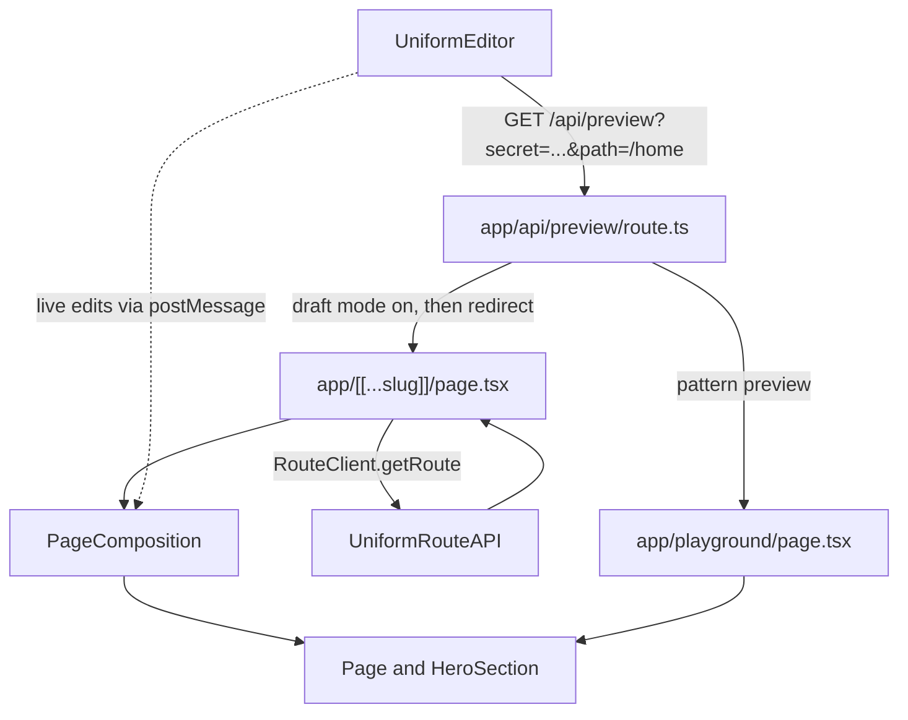

# Connecting Uniform to a Next.js App Router app

This guide walks through every piece of the Uniform integration in this project, in the order you would build it. The code files are kept short and mostly comment-free on purpose. **All the explanations live here.**

We use the lower-level packages `@uniformdev/canvas` and `@uniformdev/canvas-react` instead of the all-in-one `@uniformdev/next-app-router` starter. That means there is no middleware, no hidden `/uniform/[code]` route and no `resolveComponent` helper layer. Everything Uniform does is visible in a handful of files you can read top to bottom.

## What you will build

- A catch-all route that asks Uniform "what page lives at this URL?" and renders the answer.
- Live preview: authors edit in Uniform and see changes in your site as they type.
- A preview endpoint that Uniform calls to switch your site into draft mode.
- A playground page where authors design component patterns.



## Files at a glance

- `app/[[...slug]]/page.tsx` - server component; fetches the page from Uniform.
- `app/components/PageComposition.tsx` - client component; renders the page and enables live editing.
- `app/components/registerComponents.ts` - one list of every Uniform component.
- `app/components/Page.tsx` - the page layout (has the `content` slot).
- `app/components/HeroSection.tsx` - the Hero component.
- `app/api/preview/route.ts` - the preview endpoint Uniform calls.
- `app/playground/page.tsx` - the pattern playground.
## Step 1 - Install the packages

```bash
pnpm add @uniformdev/canvas @uniformdev/canvas-react
pnpm add -D @uniformdev/cli
```

Keep the two `@uniformdev/canvas*` packages on the same version. This project uses `pnpm` because it has a `pnpm-lock.yaml`.

- `@uniformdev/canvas` - the API client (`RouteClient`) and helpers such as `flattenValues`.
- `@uniformdev/canvas-react` - React components for rendering (`UniformComposition`, `UniformText`, `UniformSlot`, `UniformPlayground`).
- `@uniformdev/cli` - dev-only. Used by `pnpm uniform:pull` to save your Uniform definitions into `uniform-data/`. Never edit those files by hand.

## Step 2 - Environment variables

In `.env`:

```bash
UNIFORM_API_KEY=...            # needs "Read Published Compositions" permission
UNIFORM_PROJECT_ID=...
UNIFORM_PREVIEW_SECRET=hello-world
```

`UNIFORM_PREVIEW_SECRET` is a shared password. Uniform sends it to `/api/preview`, and the route refuses to turn on draft mode unless it matches. Use any value you like, but it must match the preview URL you save in Uniform (Step 4).

## Step 3 - Allow remote images

`HeroSection` uses `next/image`, and Next.js only optimises images from hosts you list. In `next.config.ts` add the host that serves your Uniform assets:

```ts
images: {
  remotePatterns: [
    { protocol: "https", hostname: "img.uniform.global" },
  ],
},
```

If an image shows a 400 error, open the image URL in the Uniform asset library, check the hostname, and add it here.

## Step 4 - Set things up in Uniform

Do this in the Uniform dashboard for **your** project (check the project id matches `UNIFORM_PROJECT_ID`).

1. **Page** - a composition definition with public ID `page`. Add one slot with public ID `content`. For the slot choose "allow all components" and turn off "inherit allowed components" and "patterns in allowed components".
2. **Hero** - a component with public ID `hero` and three parameters:
   - `title` (text)
   - `subtitle` (text)
   - `image` (asset, images only)
3. **Hero pattern** - create a component pattern from Hero with sample copy, and make every parameter overridable.
4. **A page to render** - create a composition of type Page, add a Hero to its `content` slot, and give it a project map node, for example `/home`.
5. **Preview URL** - in the project's preview settings add `http://localhost:3000/api/preview?secret=hello-world` and enable it as the playground URL.
6. Run `pnpm uniform:pull` to save the definitions into `uniform-data/`.

The public IDs matter: the strings `page` and `hero` must exactly match the `type` you register in code (Step 7). A Hero component in Uniform with the ID `Hero` would not match.

## Step 5 - Fetch the page on the server

File: `app/[[...slug]]/page.tsx`

What the folder name means: `[[...slug]]` is an *optional catch-all* route. It matches `/`, `/home`, `/products/boots` and so on, and Next.js hands the pieces of the path to the page as `slug`. Because it also matches `/`, you must **not** also have `app/page.tsx`.

What the page does:

1. `await params` - in this version of Next.js `params` is a Promise. `slug` is `undefined` for `/`, so we default it to `[]` and build `path` as `"/" + slug.join("/")`.
2. `await draftMode()` - this tells us whether the visitor came through the preview endpoint. Draft mode is Next.js's built-in "show unpublished content" switch (it is a cookie).
3. `new RouteClient({ apiKey, projectId })` and `getRoute({ path, state })`. `state` is `CANVAS_DRAFT_STATE` in draft mode (unpublished edits) or `CANVAS_PUBLISHED_STATE` for normal visitors.
4. Handle the three possible answers: `redirect` (a redirect configured in Uniform), `notFound` (no page at that path), or `composition` (a page to render).
5. Pass `route.compositionApiResponse.composition` to `PageComposition`.

Why this is a server component: it holds the API key and talks to Uniform. The key never reaches the browser, and the first HTML is rendered on the server.

## Step 6 - Render the page on the client

File: `app/components/PageComposition.tsx`

It starts with `"use client"`. Client components are used here for one reason: `UniformComposition`, `UniformText` and `UniformSlot` use React context and browser `postMessage` to receive live edits from the Uniform editor. Next.js still renders their first HTML on the server, so you do not lose SEO or fast first paint.

`UniformComposition` walks the composition data and, for each component, looks up the React component registered for its `type`.

The line `import "./registerComponents"` makes sure that every component has been registered before rendering starts.

## Step 7 - Components

### Registering

Every Uniform component is a normal React component plus one call at the bottom of the file:

```tsx
registerUniformComponent({ type: "hero", component: HeroSection });
```

`type` is the component's public ID in Uniform. `app/components/registerComponents.ts` simply imports each component file so that call runs. **When you add a new component, add one import line there.**

Component files are client components (`"use client"`) because they use `UniformText` and `UniformSlot`.

### Page

`Page.tsx` renders `<UniformSlot name="content" />`. A slot is a place where authors drop other components. The `name` must match the slot's public ID in Uniform.

### HeroSection

This is the original hardcoded component, converted:

- **Before:** `title`, `subtitle` and `imageUrl` arrived as props.
- **After:** the text is rendered with `<UniformText parameterId="title" />`. This displays the value *and* lets authors click the text in the Uniform preview and type directly. `placeholder` is what authors see when the field is empty.
- Images arrive as an asset parameter. `flattenValues(image, { toSingle: true })` turns Uniform's asset structure into one simple object, and `.url` is the image address.
- `ComponentProps<{ image?: AssetParamValue }>` types the props. Every parameter prop is optional because authors can leave things empty, even when a field is marked required.

## Step 8 - The preview endpoint

File: `app/api/preview/route.ts`

Uniform opens your site in an iframe by calling this URL, for example:

`/api/preview?secret=hello-world&path=/home&id=...&is_incontext_editing_mode=true`

The handler does these things in order:

1. **Config check.** When you save the preview URL, Uniform calls it with `is_config_check=true` to ask whether a playground exists. We answer `{ hasPlayground: true }` and allow Uniform's origin with a CORS header.
2. **Check the secret.** Wrong or missing secret returns 401. This stops strangers turning on draft mode.
3. **Decide where to go.** If Uniform is previewing a pattern (it sends an `id` but no `path`, or `is_incontext_editing_playground=true`) we go to `/playground`. Otherwise we go to `path`.
4. **Block open redirects.** The target must be on your own site.
5. **Turn on draft mode** with `draft.enable()`.
6. **Re-write the draft cookie** with `SameSite=None; Secure`. This is the subtle part. Uniform shows your site inside an iframe on `uniform.app`, a different domain. Browsers only send "SameSite=None" cookies in that situation, so without this step the page would load in published mode inside the editor and you would never see your edits.
7. **Forward the query string** so the editing flags (`is_incontext_editing_mode`) reach the page. We only forward them when the request came from Uniform (`isAllowedReferrer`).
8. **Redirect** with a 307.

Visiting `/api/preview?secret=hello-world&path=/home&disable=true` turns draft mode back off.

## Step 9 - The playground

File: `app/playground/page.tsx`

The playground is where authors build **component patterns** (reusable, pre-filled components). Uniform sends the pattern to the page using `postMessage`, so this page does no data fetching. It only needs to know how to render components.

- `page.tsx` renders `<UniformPlayground />` and imports `registerComponents` so the playground knows how to render each component.
- **Why `"use client"` on the page:** `UniformPlayground` and the registered components run in the browser.
- We deliberately do not use the `decorators` prop. Uniform marks it as deprecated and unstable (it may change or be removed in a minor release), so we avoid it in production code. To check responsive layouts, resize the preview viewport in the Uniform editor instead.

## Step 10 - Check that it works

Start the app: `pnpm dev`

1. `http://localhost:3000/api/preview?is_config_check=true` returns `{"hasPlayground":true,...}`.
2. `http://localhost:3000/api/preview?secret=wrong&path=/home` returns 401.
3. `http://localhost:3000/api/preview?secret=hello-world&path=/home` redirects (307) to `/home`.
4. `http://localhost:3000/home` shows your page once it exists in Uniform (a 404 means there is no composition for that path yet).
5. In Uniform, open the page in the visual editor. Click the Hero title and type: the text should update live.
6. In Uniform, open the Hero pattern. The playground loads and renders the pattern.

Also run `pnpm exec eslint .` and `pnpm exec tsc --noEmit`. If `tsc` complains about a file under `.next/types` that does not exist, restart `pnpm dev` once to regenerate it. Do not run `next build` while the dev server is running.

## Troubleshooting

- **Everything is a 404.** The path has no project map node/composition in Uniform, or `UNIFORM_PROJECT_ID` points at the wrong project.
- **Editor shows published content, not your edits.** The draft cookie was not sent. Check you are using `/api/preview` as the preview URL and that your browser allows third-party cookies for `localhost` while testing.
- **"Component not implemented" in the preview.** The `type` in `registerUniformComponent` does not match the Uniform public ID, or the component is not imported in `registerComponents.ts`.
- **Image fails with a 400.** Add the image host to `remotePatterns` in `next.config.ts`.
- **Clicking text in the preview does nothing.** The text is not rendered with `UniformText`, or the `parameterId` does not match the parameter's public ID.

## How this maps from the Pages Router starter

- `pages/[[...slug]].tsx` with `getServerSideProps` becomes `app/[[...slug]]/page.tsx` as an async server component.
- `withUniformGetServerSideProps` (hidden helper) becomes an explicit `RouteClient.getRoute` call.
- `pages/api/preview.ts` with `createPreviewHandler` becomes `app/api/preview/route.ts`, written out by hand.
- `pages/_app.tsx` providers are not needed yet. They return when we add personalization.
- `pages/uniform-playground/...` becomes `app/playground/page.tsx`.
- `registerUniformComponent`, `UniformText`, `UniformSlot` and `UniformPlayground` work the same in both routers.

## Recipe: add a new component

1. In Uniform, create the component (and a pattern for it) with the parameters you need.
2. Run `pnpm uniform:pull`.
3. Create `app/components/MyThing.tsx` with `"use client"`, render parameters with `UniformText` / `UniformSlot`, and call `registerUniformComponent({ type: "myThing", component: MyThing })`.
4. Add `import "./MyThing";` to `app/components/registerComponents.ts`.
## About the shadcn/ui setup

`components/ui/toggle-group.tsx` and friends were generated with the shadcn CLI. The CLI wrote `import { cn } from "cn"`, which points at an unrelated npm package. This project uses the standard helper instead: `lib/utils.ts` exports `cn` built from `clsx` and `tailwind-merge`, and the generated files import it from `@/lib/utils`. If you add more shadcn components and see `from "cn"` again, change the import the same way.

## Where this guide stops

Not covered yet, and good follow-up lessons: personalization and A/B tests (`@uniformdev/context`), header and footer slots on the Page, page metadata from composition parameters, and locales.
